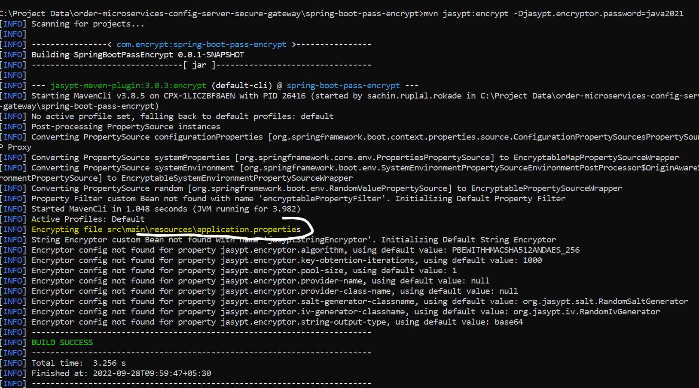

#  Step for Jasypt
**POM updated**

1. Declare dependencies for Jasypt Spring Boot and Jasypt Maven plugin

```
    <dependency>
       <groupId>com.github.ulisesbocchio</groupId>
       <artifactId>jasypt-spring-boot-starter</artifactId>
       <version>3.0.3</version>
   </dependency>
   ````

Jasypt Maven plugin

```
    <plugin>
       <groupId>com.github.ulisesbocchio</groupId>
       <artifactId>jasypt-maven-plugin</artifactId>
       <version>3.0.3</version>
    </plugin>
````

<br></br>
**Test plugin**....<br><br>
      run below command for Encrypt<br>

```
      mvn jasypt:encrypt-value -Djasypt.encryptor.password=javatest -Djasypt.plugin.value=sxxxxx
```
<br>

run below command for Decrypt<br>
```
      mvn jasypt:decrypt-value -Djasypt.encryptor.password=javatest -Djasypt.plugin.value=[Encrypted String]
```

<br></br>

**How to Encrypt properties File Value**<br>
   <br>
   1. just need to set <b>DEC</b> keyword as show below
      <br></br>   
   
<br></br>
   3. run below command then all value which is set <b>DEC</b> are Encrypted  
      ````
      mvn jasypt:encrypt -Djasypt.encryptor.password=java2021
      ````
      

<br></br>
      property file automaticaly updated with encrypted value
      

<br>
if directly Run application then below error will get reason is spring-boot not able to find private key
         
````
      Description:
           Failed to bind properties under 'spring.datasource.password' to java.lang.String:
           Reason: java.lang.IllegalStateException: either 'jasypt.encryptor.password' or one of ['jasypt.encryptor.private-key-string', 'jasypt.encryptor.private-key-location'] must be provided for Password-based or Asymmetric encryption 
      Action:
          Update your application's configuration
      `````
      resone is  while running we are not pass <b>private key</b> used below command for same
      ````
       -Djasypt.encryptor.password=java2021
 ````      
   
   pass this command as VM arrguments in Run Configuration<br></br>
   <br></br>
   
   Application is Running without fall
    <br></br>
   

<br></br>

**How to Decrypt properties File Value**<br>
    run below command with same private key and all properties value can avaliable  <br>
````
      mvn jasypt:decrypt -Djasypt.encryptor.password=java2021
 ````      


**Refrances**
https://www.codejava.net/frameworks/spring-boot/spring-boot-password-encryption